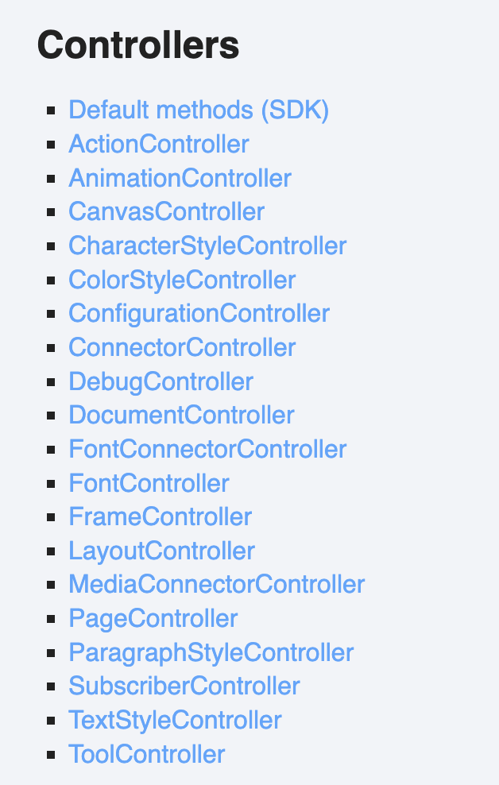
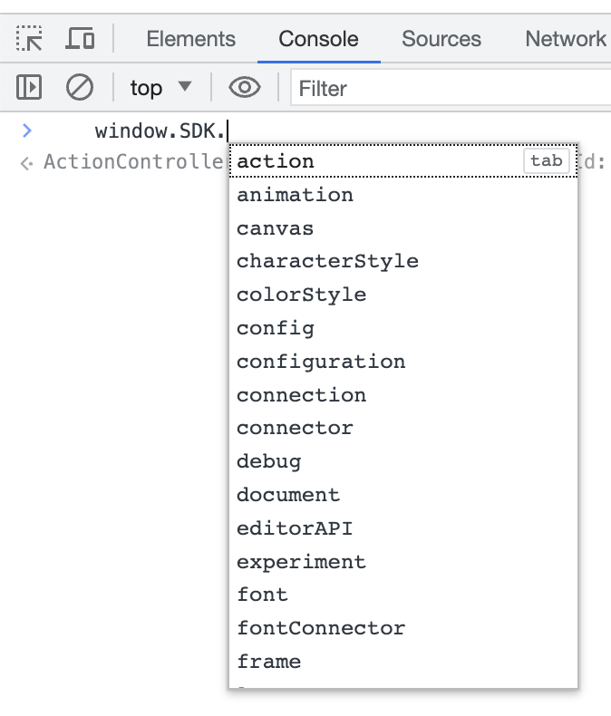
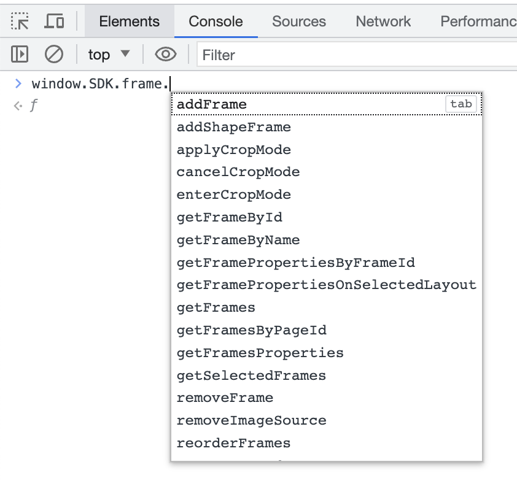
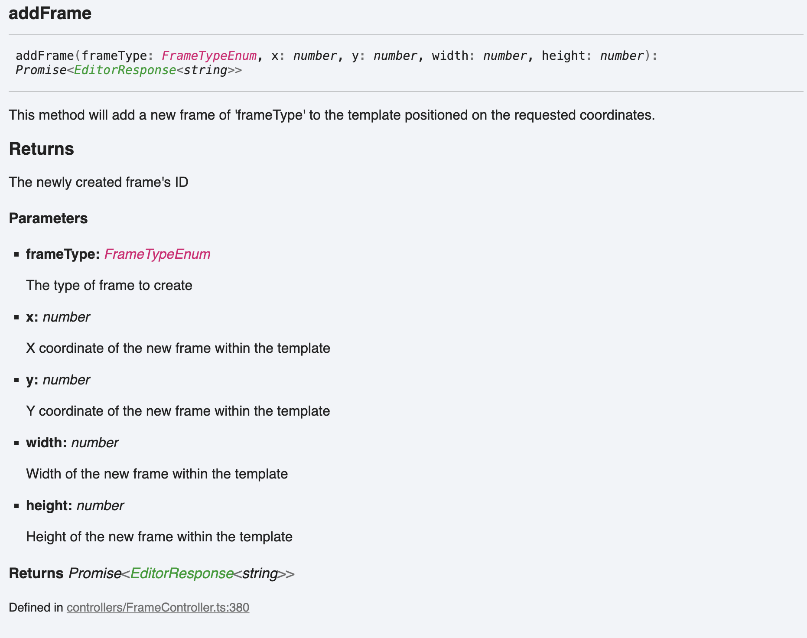
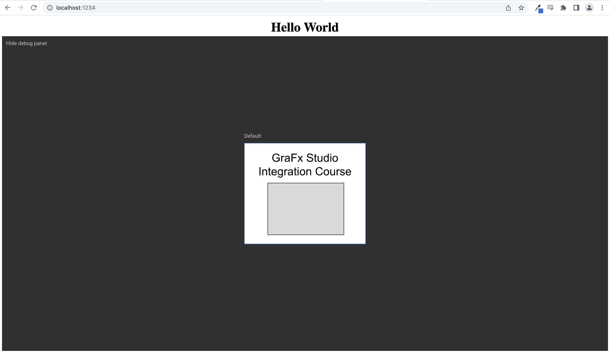
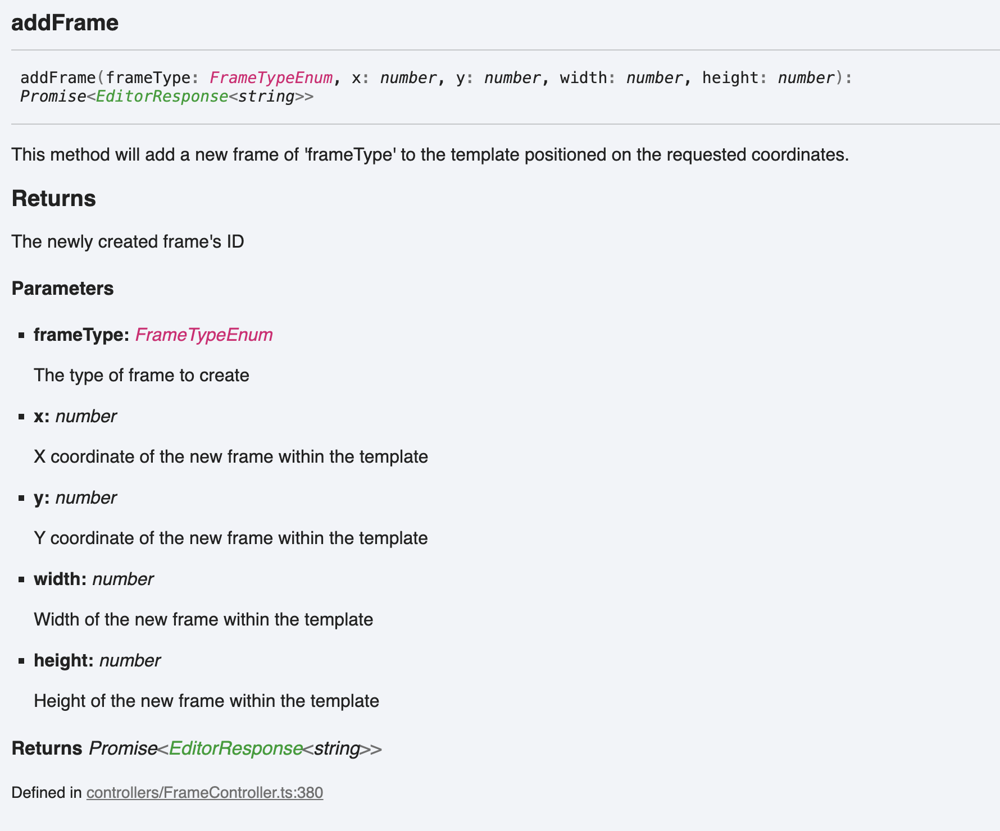
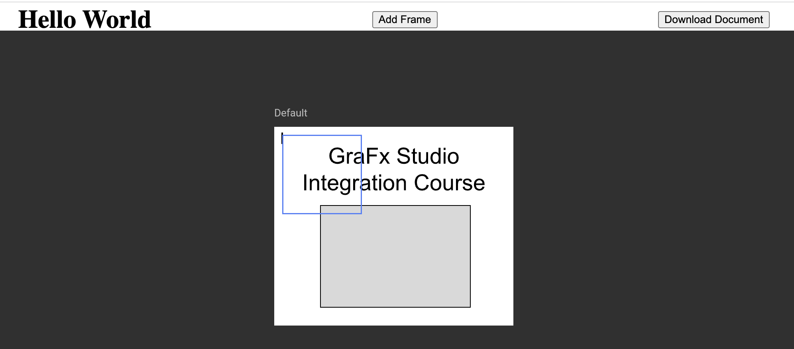

# Working with Controllers
_Note: We will be started off in this section with what we created in the previous section [Setting Up the Project](../1-Setting-up-Project/). If you are starting at this section you can get the project (so far) from the previous section by downloading and navigating to the "GraFx Integration Course" folder in that section._

_Please refer to the [Getting up and running](../README.md#getting-up-and-running) section to get the integration webserver up and running._

---

### What is a Controller?
Controllers are the primary method of interfacing with GraFx Studio, the Studio SDK exposes multiple different controllers for you to utilize in your integration. These controllers expose certain behaviors of GraFx Studio and provide you with an easy to use interface to control these behaviors.



Currently there are 19 controllers in the SDK, but you see the list of them on the Studio SDK documentation [here](https://chili-publish.github.io/studio-sdk/#controllers)

Controllers follow a simple naming convention so normally you can determine where the functions to do something might be. This is incredibly helpful when exploring the SDK in our browsers ["Developer Console"](https://balsamiq.com/support/faqs/browserconsole/) when we are on our integrations page http://localhost:1234



As you can see there are many options there, and normally you can assume what they might be related to. For example, if we wanted to manipulate a frame on page, chances are we could find functions for that in the FrameController which we can access by typing `window.SDK.frame.` and then we can see what functions are available.



This method of exploring makes it really easy to try controllers and their functions out live in our integration and test them out. You can also read about the functions of the FrameController on the [github documentation](https://chili-publish.github.io/studio-sdk/classes/controllers_FrameController.FrameController.html) for the Studio SDK. You can find the expected parameters for each function and what the function does on our source documentation.


Now that we touched on what the Studio SDK controllers can do for you, lets start using them in our integration :D

### Loading a document in to the editor
Our first controller will be the DocumentController. This is for, you guessed it, controlling the document loaded in to our Studio editor.

##### Getting a GraFx Studio document
The first the we need is an Studio document to load. GraFx Studio serializes documents in JSON format. You can choose many ways to store and load JSON but for this example we will simple store it in a variable in another file and import it to our integration.

There is not much to explain here, we are going to create a new file named `default-doc.js` in our `src` folder and we will just export a variable from this file.  It is best to just copy the code below and paste it in to that newly created file.

`default-doc.js`
```javascript
const defaultJSON = `{\"selectedLayoutId\":\"0\",\"sdkVersion\":\"0.123.0\",\"engineVersion\":\"0.0.37\",\"properties\":{\"type\":\"template\"},\"pages\":[{\"pageId\":\"0\",\"pageNumber\":0,\"frames\":[{\"frameId\":\"1\",\"frameName\":\"Frame 1\",\"frameType\":\"text\",\"constrainProportions\":false,\"textContent\":\"{\\\"textFlow\\\":[{\\\"type\\\":\\\"paragraph\\\",\\\"textAlign\\\":\\\"center\\\"},{\\\"type\\\":\\\"span\\\"},{\\\"type\\\":\\\"text\\\",\\\"content\\\":\\\"GraFx Studio Integration Course\\\"}]}\",\"paddingLeft\":0,\"paddingTop\":0,\"paddingRight\":0,\"paddingBottom\":0,\"numberOfColumns\":1,\"columnGap\":5,\"textDirection\":\"leftToRight\",\"flowDirection\":\"horizontal\",\"verticalAlign\":\"top\",\"textStroke\":false,\"textStrokeWeight\":1,\"textStrokeColor\":0,\"hasClippingPath\":false,\"blendMode\":\"normal\"},{\"frameId\":\"2\",\"frameName\":\"Frame 2\",\"shapeProperties\":{\"enableFill\":true,\"fillColor\":{\"color\":{\"colorType\":\"rgb\",\"r\":217,\"g\":217,\"b\":217},\"usageType\":\"local\"},\"enableStroke\":true,\"strokeWeight\":1,\"strokeColor\":{\"color\":{\"colorType\":\"rgb\",\"r\":0,\"g\":0,\"b\":0},\"usageType\":\"local\"},\"allCornersSame\":true},\"frameType\":\"shape\",\"src\":{\"shapeType\":\"rectangle\",\"cornerRadius\":{\"type\":\"none\"}},\"blendMode\":\"normal\",\"constrainProportions\":false}]}],\"layouts\":[{\"layoutId\":\"0\",\"layoutName\":\"Default\",\"frameProperties\":[{\"frameId\":\"1\",\"x\":16,\"y\":26,\"width\":268,\"height\":54,\"rotationDegrees\":0,\"rotationOriginY\":0,\"scaleX\":1,\"scaleY\":1,\"included\":true,\"fitMode\":\"fill\",\"framePropertiesType\":\"top\",\"minCopyfitting\":0.1,\"maxCopyfitting\":10,\"enableCopyfitting\":true},{\"frameId\":\"2\",\"x\":58,\"y\":99,\"width\":188,\"height\":128,\"rotationDegrees\":0,\"rotationOriginY\":0,\"scaleX\":1,\"scaleY\":1,\"included\":true,\"fitMode\":\"fill\",\"framePropertiesType\":\"top\",\"minCopyfitting\":0.1,\"maxCopyfitting\":10,\"enableCopyfitting\":false}],\"width\":300,\"height\":250,\"childLayouts\":[],\"layoutType\":\"top\",\"frameAnimations\":[{\"frameId\":\"1\",\"from\":0,\"to\":5000,\"basicAnimations\":{}},{\"frameId\":\"2\",\"from\":0,\"to\":5000,\"basicAnimations\":{}}],\"timelineLengthMs\":5000,\"animated\":true}],\"styleKit\":{\"colors\":[],\"characterStyles\":[],\"paragraphStyles\":[],\"fonts\":[]},\"variables\":[],\"connectors\":[{\"id\":\"grafx-media\",\"source\":\"local\",\"url\":\"grafx-media.json\",\"options\":{},\"mappings\":[]},{\"id\":\"grafx-font\",\"source\":\"local\",\"url\":\"grafx-font.json\",\"options\":{},\"mappings\":[]}],\"actions\":[]}`

export { defaultJSON }
```

Now in back in our `index.js` we can import this document JSON by adding an import statement at the top of the file with our other import.

```javascript
import { defaultJSON } from "./default-doc.js"
```

##### Creating a loadDocument() function
Let's create a function that will take some JSON and load it in to the editor. This will be our first async function since under the hood, we are actually sending a message for the editor to do something, and the editor will response to us with a promise that it will do it, we will wait for that promise to actually happen using the `await` keyword.

```javascript
async function loadDocument(docJSON) {
  if (docJSON) {
    await window.SDK.document.loadDocument(docJSON);
  } else {
    await window.SDK.document.loadDocument("{}");
  }
}
```

You can see we have an `if` statement in our function to check if we actually provided the function with document JSON or not. If the function is not called with document JSON provided, it will simply load an empty document in the `else` case.

We can now call this function at the bottom of our `initEditor()` function, but remember that since our loadDocument function is asynchronous, we will need to `await` it in our `initEditor()` function which means that we also need to make it asynchronous (only asynchronous functions can use `await`). To do this we just need to make a couple small modifications to our function.

```javascript
async function initEditor() {
  const SDK = new StudioSDK({
    editorId: "studio-editor"
  });

  SDK.loadEditor();
  window.SDK = SDK;

  await loadTemplate(defaultJSON);
}
```

We are simply adding `async` in front of our function and then awaiting the `loadDocument` function that we supply with the default document JSON we imported.

Now with the server running our integration page should look something like this



### Extracting the template JSON from the editor
After the studio session is done, we probably want to get the underlying document JSON to save to our database or persist somewhere else. For this course we are going to create a "Download Template" button. Creating this download button will require some more advanced JavaScript. We will first add a hidden `<a>` element to our `index.html`. This is the element we will use to attach the document data to so we can download it.

Right below the editor `<div>` we can add this element
```html
<div style="height: 90vh" id="studio-editor"></div>
<a id="downloadAnchor" style="display:hidden"></a>
```

Next let's create out button to trigger the JavaScript we will create. We will do this under the `<h1>` header we created earlier.
```html
<h1>Hello World</h1>
<button onclick="downloadDocument()">Download Document</button>
```

Finally, we need the JavaScript to actually power this function! Lets switch back over to our `index.js` file and add some logic.

The primary function will be to actually extract the document JSON from the DocumentController. For that we will create an async function named `getDocumentJSON()` that will returned the stringified (so we can easily store it) version of the JSON for the document currently in the editor.

```javascript
async function getDocumentJSON() {
  const documentJSON = (await SDK.document.getCurrentDocumentState()).data
  return JSON.stringify(documentJSON)
}
```

Then we will create out actual `downloadDocument()` function that will do some JavaScript magic to create a file for our document JSON and attach it to the `<a>` element we made earlier and then actually click the hidden element to download the file. This is a neat trick in JavaScript you can do to download a file with JavaScript but it isn't important to know for this course so you can just copy and paste the code.

```javascript
window.downloadDocument = async function() {
  const documentJSON = await getDocumentJSON();
  const documentData = "data:text/json;charset=utf-8," + encodeURIComponent(documentJSON);
  const downloadAnchor = document.getElementById('downloadAnchor');
  downloadAnchor.setAttribute("href", documentData);
  downloadAnchor.setAttribute("download", "document.json");
  downloadAnchor.click();
}
```

Hopefully your integration will now have a "Download Document" button that downloads the document JSON when you click it!


### Adding a frame
Our last controller interaction will be a button that adds a text frame to our integration.

To do this we can look at the Studio SDK documentation and find under our FrameController the [addFrame()](https://chili-publish.github.io/studio-sdk/classes/controllers_FrameController.FrameController.html#addFrame) method.



This takes a [FrameTypeEnum](https://chili-publish.github.io/studio-sdk/enums/index.FrameTypeEnum.html) but as you can see clicking FrameTypeEnum in the documentation will let you know what valid types are part of that Enum. Add the moment there are "text", "shape" and "image" frame enum types.

Let's create a simple function that creates a 100x100 text frame at the position `x:10 y:10`.
```javascript
window.addTextFrame = async function() {
  await window.SDK.frame.addFrame("text", 10, 10, 100, 100);
}
```

Then we can simply just add another `<button>` to our `index.html` calling that function.

```html
<button onclick="addTextFrame()">Add Frame</button>
```

Now when we click that button we should get a new text frame being added.



