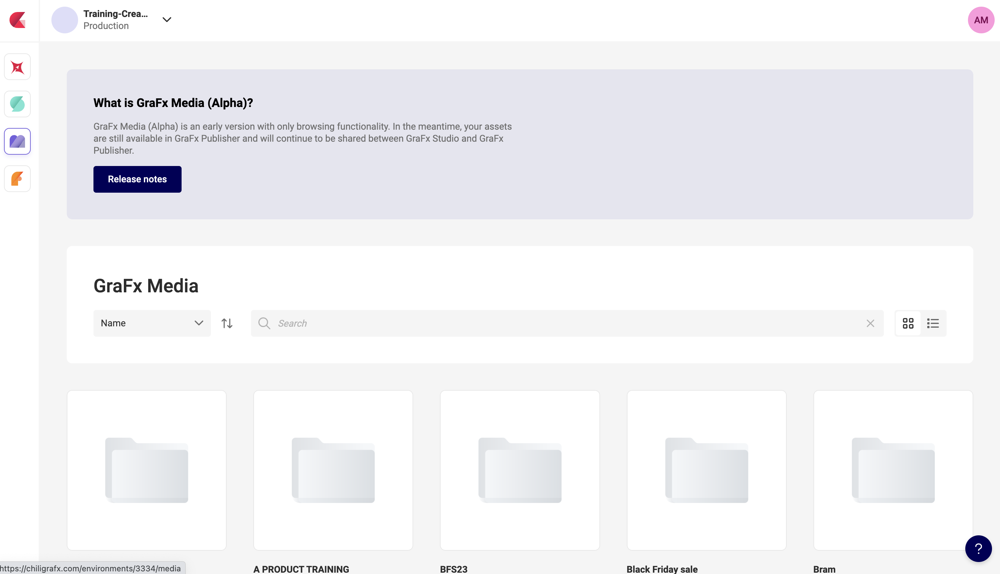

# Working with Connectors
_Note: We will be started off in this section with what we created in the previous section [Setting Up the Project](../1-Setting-up-Project/). If you are starting at this section you can get the project (so far) from the previous section by downloading and navigating to the "GraFx Integration Course" folder in that section._

_Please refer to the [Getting up and running](../README.md#getting-up-and-running) section to get the integration webserver up and running._

---

### What is a Connector?
GraFx Studio has the ability to pull in data from various sources. Most commonly you will pull in data from you GraFx environment but our studio actually provides you with an easy framework to pull in data from your sources. This framework is known as the GraFx Connector framework.

A connector in the literal sense is an implementation of a set of capabilities and methods needed by GraFx Studio to interact with an external resource management system. If you define how your system can provide those capabilities in the connector, then GraFx Studio can talk to your system to get resources as well. For now, we are going to configure out integration to talk to the GraFx Environment API using the built-in `Grafx-Media` connector to load images from our GraFx environment and the `GraFx-Fonts` connector to load fonts from our GraFx environment.

### Authentication
The first thing we need to do is actually generate an authentication token. We need to do this because the GraFx Environment API that actually has the fonts and assets requires requests to be authenticated and authorized via a token. Therefore, we need to provide our GraFx-Media and GraFx-Fonts connector with our token so they can pull the required fonts and assets.

First, you will need to create a machine on your GraFx environment so that you have the required credentials to generate the authentication token. You can do that following [this guide](#good-luck). Please note the `client id` and `client secret` you are provided when doing this, we will use them to generate our token at a later step.

### Connecting the Connectors
Now that we have our token, we can actually initialize our media and font connector when we load a document. To do this we will need to add some more logic to our `loadDocument()` function.

```javascript
async function loadDocument(docJSON, authToken) {
  if (docJSON) {
    await window.SDK.document.load(docJSON);
  } else {
    await window.SDK.document.load("{}");
  }

  if (authToken) {
    await window.SDK.connector.configure('grafx-media', async function(configurator) {
      await configurator.setChiliToken(authToken);
    });
    await window.SDK.connector.configure('grafx-font', async function(configurator) {
      await configurator.setChiliToken(authToken);
    });
  }
}
```

We are now optionally adding an `authToken` parameter to our `loadDocument` function, if we pass the function a token it will register the `grafx-media` connector and then `grafx-font` connector. The way you initialize a connector within the StudioSDK is with the ConnectorController `configure` method. You can find the SDK documentation for this method [here] (https://chili-publish.github.io/studio-sdk/classes/controllers_ConnectorController.ConnectorController.html#configure)

Essentially, we are calling the `configure` method and the first argument is what connector we want to configure. For example to use the `GraFx Media` connector we specify `grafx-media` as the first argument. The second argument is a little more tricky, because we don't actually configure the GraFx Media connector right away, we install need to tell it "how to configure itself" when it is ready. To do this we provide something called a "callback function" which is a function that the GraFx Media connector will use to configure itself when it is ready. So we provide a function as the second parameter that attaches the `authToken` to the connector when it is ready.

We then proceed with the same steps for the GraFx Fonts connector, except that connector is called `grafx-fonts`.

There is one last step we need to setup before our connectors work, we need to tell the editor where our GraFx Environment API is located. We do this using the ConfigurationController. This controller allows you to store metadata on the editor session at runtime. This metadata is intended to be accessed from Studio Actions and Studio Connectors. So we will tell the editor where the GraFx Environment API is located, and the editor will store that information, then anytime the GraFx Media connector or GraFx Font connector needs to know where the the Environment API is located it can simply just ask the ConfigurationController.

We will add this line at the top of our `loadDocument` function.
```javascript
  const environmentAPI = window.SDK.utils.createEnvironmentBaseURL({type: "production", environment: "training-create-us23"})
  window.SDK.configuration.setValue("ENVIRONMENT_API", environmentAPI);
```

Before we can set the GraFx Environment API Base URL that our connectors will use to talk to the environment. We have a helper function in our SDK UtilsController called "createEnvironmentBaseURL" that can help build the Environment API base url for us. We will call this function with our environment type, `sandbox` or `production` and the environment name (ex: cp-gjd-940).

Then we can set the `"ENVIRONMENT_API"` value in our configuration store to be that GraFx Environment Base URL, now our connectors know how to talk to your GraFx Environment.

We will also want to update our initEditor() function to accept the `authToken` parameter that we will also pass to to `loadDocument` function.

```javascript
async function initEditor(authToken) {
  const SDK = new StudioSDK({
    editorId: "studio-editor"
  });

  SDK.loadEditor();
  window.SDK = SDK;

  await loadDocument(defaultJSON, authToken);
}
```

Now when we call the `initEditor()` function we need to pass the authentication token for our connectors to use. For your integration, you have a couple different options. To maintain a secure integration, you should ideally have the front-end of your integration reach out to a back-end for the token we will generate, or pre-process the page to provide the token.
<!-- TODO(link to auth documentation on the GraFx website) -->

For the CREATE 2023 Studio integration training, we will all be connecting to a specific environment to load the asset provided in the demo document so I will provide you with an access token.

```
eyJhbGciOiJSUzI1NiIsInR5cCI6IkpXVCIsImtpZCI6InIzTzViUFFqV2pBWjNsd1pLd1FSaSJ9
```

At the bottom of our `index.js` file we can create a variable to hold this token and then pass the variable when we call `initEditor`

``` javascript
const authToken = "<INSERT TOKEN HERE>"
initEditor(authToken);
```


### Actually loading an image frame

Now, for this course we are going to simply find an asset on our environment and load it in to an image frame. So first we will need to find an image on our environment that we can use. Navigate to your environment at [https://chiligrafx.com/](https://chiligrafx.com/)

Click on the GraFx Media icon on the left hand panel to load up the available assets on your environment. If your environment has assets, you should see some folders you can browse through to find assets.



Once you have found an asset you want to display in an image frame, you can click the `...` button to bring up the option to view asset details.


In the asset details panel, you will see the ID for the asset. Copy this ID, we will use it to tell our GraFx Media connector which asset we want to use for our image frame.


Make note of that asset ID, this is how we will inform our GraFx Media connector which asset we want to use. For this course, we will just create a simple button, that when pressed will replace the image frame on the document with

-- CREATE COURSE 23' --
For the Studio Integration Course we will use this asset id.
```
ba831d4b-af20-467b-a3a3-b2866fda687b
```

---
##### Setting the asset for an image frame
Let's create a function to update the image on our document to a new image we provide it. We will be using a [FrameController]() method to find our image frame in the document and then the ConnectorController to update the image.

Let's create a button in our `index.html` that when pressed will call the SDK function to update the image frame in our document to the new asset ID we provide.


```html
<button onclick="window.SDK.frames.setImage('image-frame', 'ba831d4b-af20-467b-a3a3-b2866fda687b')">Update Image</button>
```

This button will call the `setImage` function of the FrameController and provide it with the two things it needs, the name of the image frame in the document we want to update, and the asset ID we want to update that image to.

##### What if I don't know the name of my image frame?
There are a couple of options one could use to determine the name of an image frame within their template.

The non-programmatic approach would be to open the template in GraFx Studio, click on the frame, and view (or change) the name in the Frame properties panel.

The programmatic approach would be to either:
1. Get all frames on the document and find the frame in the JSON where the type is an image you can get all frames by playing in the  JavaScript console of your browser and typing `await window.SDK.frames.getAll()` but this requires some more manual investigation if you have more than 1 image frame on the document.
1. Use the