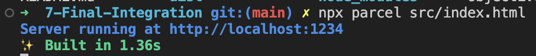
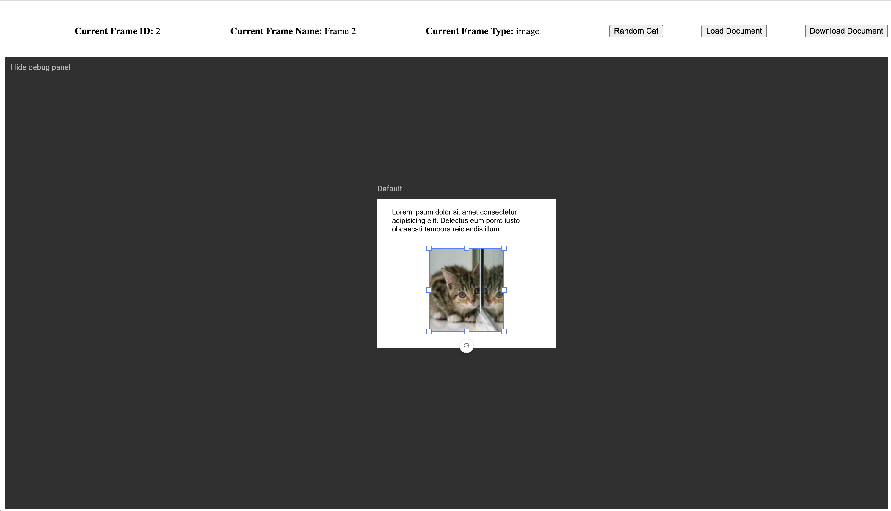

# The Final Integration

This folder contains the completed course project files. You can download this folder and view the integration for yourself in just a few simple steps.

### Setting up
This is an Node project that contains Parcel, a web server and JavaScript bundler that will build and host the integration on your local machine for development and testing. This Node project also has well as the [Studio-SDK](https://www.npmjs.com/package/@chili-publish/studio-sdk) package created by us to interact with the GraFx Studio editor.

Please make sure you have [Node.js](https://nodejs.org) installed.

Once you download this folder you will simple open your favorite shell or terminal emulator and navigate to the directory of the project.

Now to install the Parcel bundler and GraFx Studio SDK you will simply type.
```sh
npm install
```

After these packages have finished installing you should be able to simply build and start your website with the following command
```sh
npx parcel src/index.html
```

If all goes well you should see something like this


Now you can visit the integration by going to
http://localhost:1234


