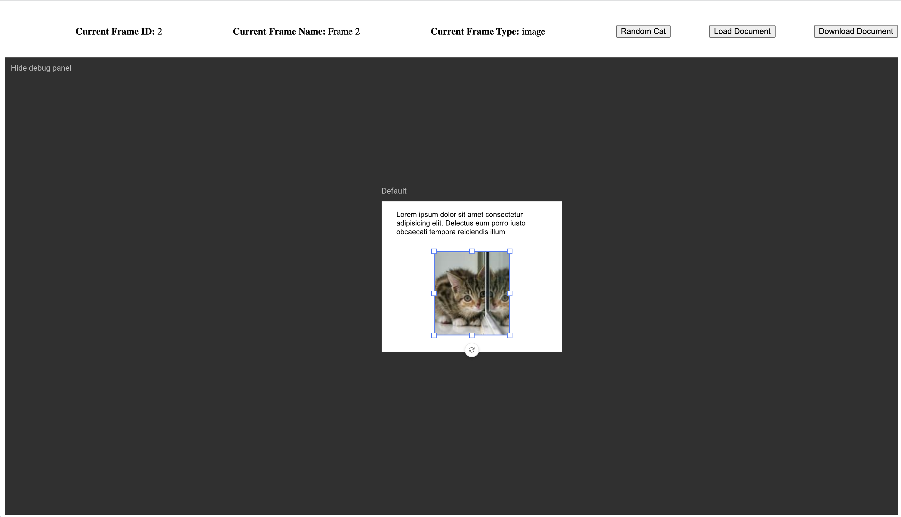

# GraFx Studio Integration Training

Welcome to the introductory course of GraFx Studio integration training. The goal of this course is to provide all the information needed to get a custom integration of GraFx studio up and running. This course will provide both code samples you can reference for every step of the process as well as discussion in each section to provide insight on how we will build each part of our integration.

Please feel free to skip ahead to any section of this course if you are looking to reference a specific item.


### The Course
This course is broken up in to sections. In each section we will add some additional functionality to our integration until we reach the [end result](#the-end-result). Each section is represented in this repository as a folder. You can also use the table of contents below to navigate to the various sections.

1. [Setting up the project](./1-Setting-Up-Project/)
1. [Loading the Editor](./2-Loading-The-Editor/)
	- Installing the Studio-SDK
	- Configure the SDK (initialize media/font connector)
	- Load the GraFx Studio editor
1. [Async/await with JavaScript](./3-Async-Javascript/README.md)
	- Why we use async
1. [Working with Controllers](./4-Working-with-Controllers/README.md)
	- Overview
	- DocumentController
	- VariableController
	- FrameController
1. [Working with Connectors](./5-Working-with-Connectors/)
	- The GraFx Media connector
1. [Working with Events](./6-Working-with-Events/)
	- OnDocumentLoad
	- OnSelectedFrameContentChanged
		- Detecting if the selected frame is an image

### The end result

The end result of this course will look like the image above. Our integration will have 4 buttons and a basic property panel to display information about the currently selected frame.

##### Frame Properties
- Currently selected frame ID
- Currently selected frame name
- Currently selected frame type

##### The Buttons
- A button to load a Studio document in to the editor
- A button to download the document currently in the editor
- A button to place a new text frame in the document
- A "Random Cat" button that appears when we select an image frame that allows us to set any image frame to a fun kitten.


You can find a copy of the final integration source code in the [7-Final-Integration](./7-Final-Integration/) folder. There are also instructions there for running the integration locally.

### Getting up and running
You can follow allow at any point in this course but to do so you will need to follow these basic steps.

If you have not started the web server before you will need to setup and initalized the Node project using the [Installing the dependencies](#installing-the-dependencies) section below. If you _have_ installed the dependencies already then you can simply start the server back up with [Starting the integration webserver](#starting-the-integration-webserver)

##### Installing the dependencies
This is an Node project that contains Parcel, a web server and JavaScript bundler that will build and host the integration on your local machine for development and testing. This Node project also has well as the [Studio-SDK](https://www.npmjs.com/package/@chili-publish/studio-sdk) package created by us to interact with the GraFx Studio editor.

Please make sure you have [Node.js](https://nodejs.org) installed.

Once you download a "GraFx-Integration-Course" folder from the desired section of this course you will simple open your favorite terminal and navigate to the directory of the project.

Now to install the Parcel bundler and GraFx Studio SDK you will simply type.
```sh
npm install
```

After these packages have finished installing you should be able to simply build and start your website.

###### Starting the integration webserver
Using your favorite terminal make sure you navigate to the project directory (the "GraFx-Integration-Course folder) and then type the following command.
```sh
npx parcel src/index.html
```

If all goes well you should see something like this


You can now visit the integration by going to
http://localhost:1234

